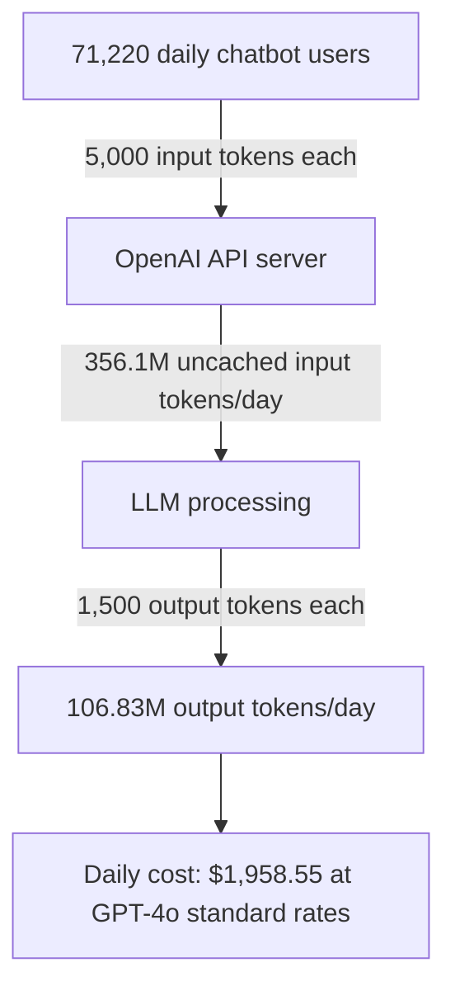
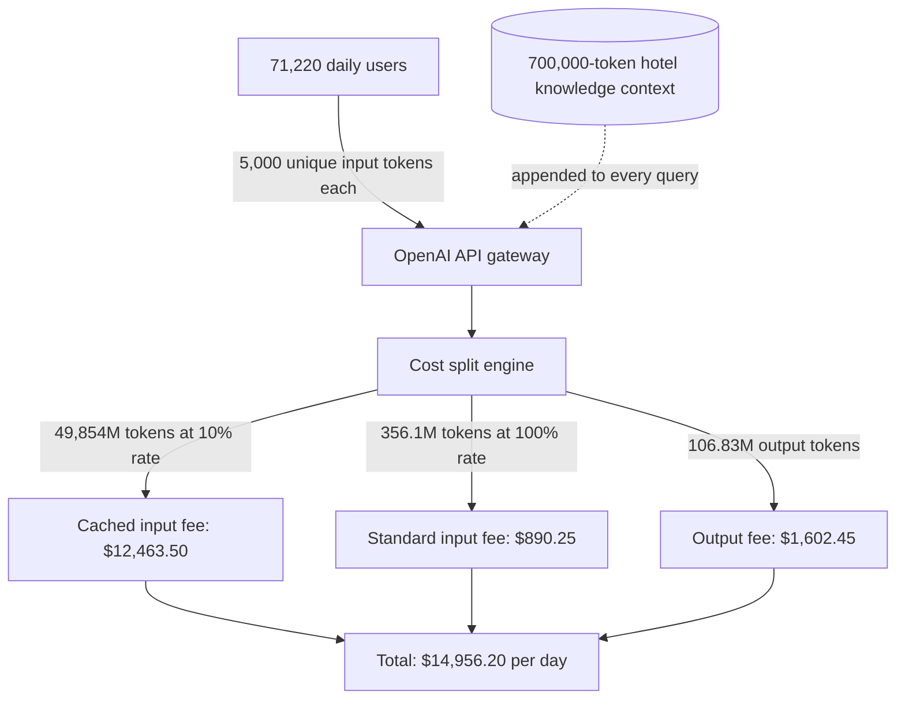
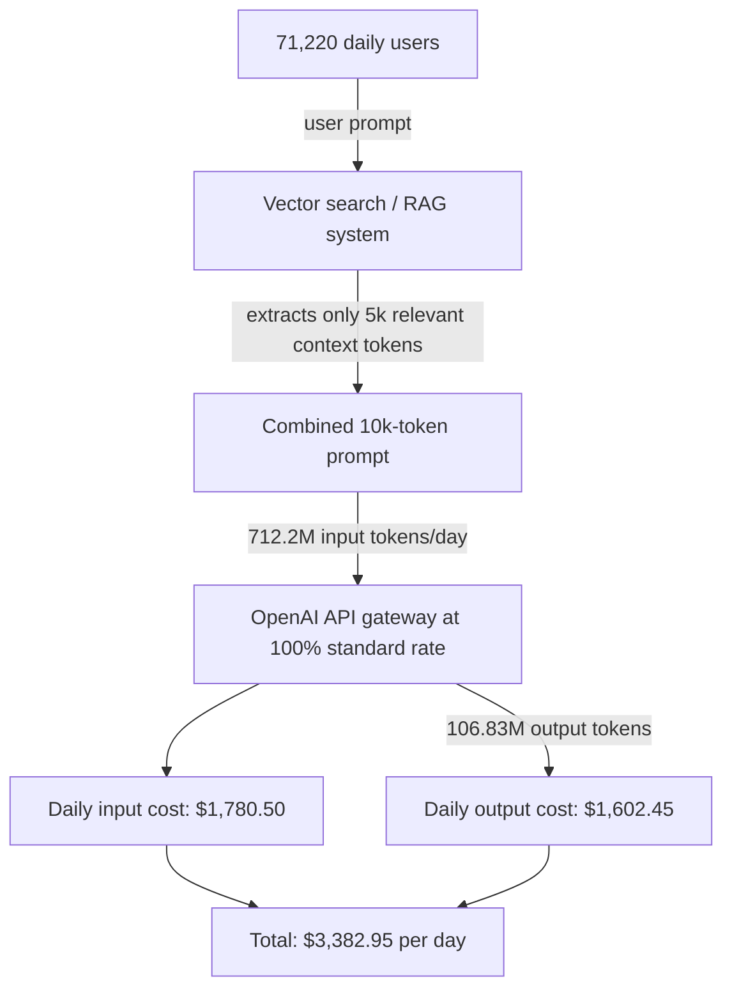

I recently tried to answer a question that comes up constantly in AI product planning: how much load does Tripadvisor's AI travel assistant put on its models each day, and what does that cost when none of the real numbers are public? Tripadvisor's "Build a Trip with AI" planner launched as a free, OpenAI-powered beta, and the company publishes its review corpus — over one billion first-party reviews — but nothing about query volume or API spend. So I built the numbers from first principles, priced them across model tiers, and then stress-tested the assumptions. Below is the full calculation, every figure I kept from my original research, and where the source material itself was inconsistent.

## Why I had to estimate

Exact, real-time query counts for internal operations like the Tripadvisor AI travel assistant are proprietary and not publicly published. What I do have is public web analytics and industry benchmarks. A report cited in my research notes says more than 70% of travellers now rely on AI for planning, though only about half trust it for the final booking — adoption of the *category* is real even if this one product's share is unknown. That is exactly the situation where an estimation model beats waiting for an official number. The same approach drives the traffic-side math in [User Stats](/user-stats) and the corpus sizing in [Data size estimation](/data-size-estimation).

## The estimation model, step by step

I build the load estimate as a chain of five multiplications. Each step is deliberately conservative, and I show the arithmetic so you can substitute your own assumptions.

**Step 1 — Platform traffic.** Tripadvisor handles approximately **106.83 million visits per month** (a Semrush report has 106.83M visits for August 2026, with an average duration of 07:10, 2.52 pages per visit, a 62.95% bounce rate, and a 45% desktop / 55% mobile split). Dividing by 30 days:

```text
106,830,000 visits / 30 = 3,561,000 daily visits
```

**Step 2 — Chatbot adoption.** Global traveler surveys put conversational AI usage for early itinerary planning between **14% and 34%**. I deliberately assume only **2%** of daily visitors engage with the native "Build a Trip with AI" tool, because the planner is one feature on a site whose visitors mostly arrive searching for a specific hotel:

```text
3,561,000 × 0.02 = 71,220 daily active users (DAU) on the chatbot
```

**Step 3 — Sessions per user.** I assume one planning session per DAU per day — a conservative floor for a trip planner, where users often return over several days but many sessions are quick single looks.

**Step 4 — Tokens per session.** A structured travel itinerary query is served with retrieval-augmented generation (RAG) over Tripadvisor's 1 billion+ reviews. A comprehensive planning session — user prompt, system routing instructions, retrieved context injection, and structured multi-day itinerary output — averages roughly **5,000 input tokens and 1,500 output tokens** per user.

**Step 5 — Daily token volume.**

```text
Input:  71,220 users × 5,000 tokens  = 356,100,000  = 356.1 million input tokens/day
Output: 71,220 users × 1,500 tokens  = 106,830,000  = 106.83 million output tokens/day
```

If you like the reproducible version, this is the whole model in a few lines:

```python
monthly_visits = 106.83 * 10**6      # ~107 million visits per month
daily_visits = monthly_visits / 30    # 3,561,000

adoption_rate = 0.02                  # conservative vs. the 14-34% survey band
daily_chatbot_users = daily_visits * adoption_rate   # 71,220 DAU

input_tokens_per_user = 5000
output_tokens_per_user = 1500

daily_input_tokens = daily_chatbot_users * input_tokens_per_user    # 356.1M
daily_output_tokens = daily_chatbot_users * output_tokens_per_user  # 106.83M

# GPT-4o / GPT-5.4 standard rate: $2.50 input / $10.00 output per 1M
cost_1 = daily_input_tokens / 1e6 * 2.50 + daily_output_tokens / 1e6 * 10.00
# Frontier flagship rate: $5.00 input / $30.00 output per 1M
cost_2 = daily_input_tokens / 1e6 * 5.00 + daily_output_tokens / 1e6 * 30.00
```

One coincidence worth flagging so it doesn't confuse you later: 106.83 appears twice — as monthly visits in millions and as daily output tokens in millions. They are unrelated quantities that share digits because output tokens per session are 30% of input tokens per session while monthly visits are 30 times daily visits.

## Pricing the baseline load by model tier

OpenAI charges purely per token, so the same load maps to a range of daily bills depending on which tier the architecture lands on. Balancing quality, latency, and cost, the workload fits one of two deployment scenarios:

| Model option | Input pricing (per 1M) | Output pricing (per 1M) | Calculated daily cost | Estimated monthly cost | Best for |
| :-- | :-- | :-- | :-- | :-- | :-- |
| **GPT-5.4 / GPT-4o standard** | **$2.50** | **$10.00** | **$1,958.55** | **~$58,756.50** | Production baseline with strong multimodal and contextual execution. |
| **GPT-5.5 / GPT-5 flagship** | **$5.00** | **$30.00** | **$4,985.40** | **~$149,562.00** | Premium agentic framework handling deep reasoning and extensive data context. |

The standard-tier line comes from:

```text
356.1M / 1M × $2.50   = $890.25    (input)
106.83M / 1M × $10.00 = $1,068.30  (output)
$890.25 + $1,068.30 = $1,958.55 per day  → × 30 ≈ $58,756.50 per month
```

and the flagship line the same way with $5.00 and $30.00, giving $1,780.50 + $3,204.90 = **$4,985.40 per day**, about $149,562.00 per month.

Large enterprise builds like Tripadvisor's typically add mitigation layers that raw table math ignores: **prompt caching** (saving up to 90% on repeated inputs) and the **Batch API** (50% off non-urgent pipelines) can slash these baselines, and smaller high-speed tiers such as GPT-5 mini or GPT-4o mini would shrink them further. Here is the no-cache request flow that both mitigations are trying to improve:





## Prompt caching and the 700k-token context

Caching changes one thing: tokens you send repeatedly are billed at a fraction of the input rate instead of full price. I modeled the extreme case — pinning a **0.7M token (700,000 token) hotel knowledge context** to the cache and reusing it for every query, on top of the standard 5,000 unique input and 1,500 output tokens per user. Cached inputs bill at 10% of the standard rate (a 90% discount) on the frontier models in this pricing set.

The daily volumes across 71,220 DAU become:

```text
Cached inputs:    71,220 × 700,000 = 49,854 million tokens/day
Standard inputs:  71,220 ×   5,000 =    356.1 million tokens/day
Outputs:          71,220 ×   1,500 =    106.83 million tokens/day
```

Scenario A, the workhorse production model (GPT-5.4, $2.50/M input, $15.00/M output, $0.25/M cached input):

```text
Cached:   49,854M × $0.25  = $12,463.50
Standard:    356.1M × $2.50  =    $890.25
Output:    106.83M × $15.00 =  $1,602.45
Total: $14,956.20/day  →  ~$448,686.00/month
```

Scenario B, the premium flagship tier (GPT-5.6 Sol, $4.00/M input, $20.00/M output, $0.40/M cached input):

```text
Cached:   49,854M × $0.40  = $19,941.60
Standard:    356.1M × $4.00  =  $1,424.40
Output:    106.83M × $20.00 =  $2,136.60
Total: $23,502.60/day  →  ~$705,078.00/month
```





The "massive context" tax is the real lesson. Without caching, 49,854M tokens billed at the standard $2.50/M would cost $124,635 for inputs alone — and my source rounds the whole no-cache stack to **"over $125,000 per day on GPT-5.4"**, which checks out: adding the standard-input and output components gives $127,127.70. Caching pulls that down to $14,956.20, a saving of $112,171.50 per day — a huge discount applied to a volume that should never have existed in the first place.

:::note
**Which model actually produced $14,956.20/day?** The transcript labelled this figure "GPT-4o Tier", but the math behind it uses $2.50/M input and **$15.00/M output** — the GPT-5.4 workhorse rates — while the baseline table earlier in the same research priced GPT-4o standard output at **$10.00/M**. I kept both prices because they answer different questions: $10.00/M is the GPT-4o standard rate the baseline $1,958.55/day was billed at, and $15.00/M is the GPT-5.4 rate the cached-context scenarios were billed at. The follow-up in my source confirms $14,956.20/day belongs to the GPT-5.4-equivalent ("workhorse production") tier at $2.50/$15.00, not to $10.00-output GPT-4o. If you rerun Scenario A at a strict $10.00/M output, the output line becomes $1,068.30 and the total drops to $14,422.05/day — but that is my recomputation, not the source's figure.
:::

**Break-even reasoning.** A 90% discount on a huge pinned context is not automatically cheap. Per query, the cached design pays 700,000 × $0.25/M = $0.175 for the shared context plus $0.0125 for the 5,000 unique input tokens, while the 5k-RAG design in the next section pays 10,000 × $2.50/M = $0.025 of input. Generalizing, caching a shared block of `N` tokens beats the RAG design only while `N × $0.25/M + $0.0125` stays below $0.025 — a break-even context size of **about 50,000 tokens** (I verified: 50,000 × $0.25/M = $0.0125, which exactly offsets the $0.0125 of retrieval context the RAG path buys instead). At 700,000 tokens the cached design sits roughly 14 times past break-even, so the 90% discount is only papering over the fact that 700k tokens is the wrong amount of context to send 71,220 times a day.

## The 1-billion-review RAG angle

The reason my baseline assumes 5,000 input tokens per session is retrieval: a comprehensive itinerary has to be grounded in Tripadvisor's corpus of over one billion first-party reviews, and no model can carry that corpus in one prompt. The 700k experiment above is the caricature of the naive fix — dumping a whole hotel database into every request. The sane architecture is a vector database that retrieves only the relevant passages, which is exactly the case laid out in [Why need RAG if Gemini can answer](/why-need-rag-if-gemini-can-answer) and [RAGs](/rags), sized by [Data size estimation](/data-size-estimation), and served from a [scalable vector database](/scalablae-vector-database). My source's own optimization suggestions are the hybrid routes: slice the 700k context down via vector search so you load only about 20k tokens per prompt, or shift heavy traffic to an efficiency tier like GPT-5.6 Terra ($2/M input) or GPT-5.4 mini.

## Capping every chat at 5k context tokens

I then ran the disciplined version: a hard cap where each chat carries at most **5,000 RAG-selected context tokens** on top of the 5,000 unique prompt tokens — a 10,000-token input payload per request, with no caching hits because the retrieved slices are per-user and hyper-personalized.

```text
Input:  71,220 × 10,000 = 712.2 million tokens/day
Output: 71,220 ×  1,500 = 106.83 million tokens/day

Input cost:   712.2M × $2.50/M  = $1,780.50
Output cost: 106.83M × $15.00/M = $1,602.45
Total: $3,382.95/day at the same GPT-5.4-tier workhorse rates
```

Compared with the $14,956.20/day cached design, trimming context to 5k via RAG **saves over $11,500 per day (~$345,000/month)**.

:::note
Recomputing the source's own arithmetic, the exact saving is $14,956.20 − $3,382.95 = **$11,573.25/day**, i.e. $347,197.50/month — the source's "~$345,000/month" is a rounded reading of the same difference, so both are on the record here. Also note the $1,602.45 output line again uses the $15.00/M GPT-5.4 rate, consistent with the cached scenarios, not the $10.00/M row of the baseline table.
:::





The verdict writes itself: architecture moved the bill by roughly 4.4× (from $14,956.20 down to $3,382.95) while model tier moved it by 2.5× ($1,958.55 to $4,985.40 on the uncached baseline). Context discipline is the bigger lever, and it is the same conclusion as [caching LLM chats to answer queries without RAG](/caching-llm-chats-to-quick-answer-user-query-without-rag) — caches and retrieval are substitutes spending from the same token budget.

## What do 5,000 tokens look like on paper?

A useful intuition check before defending those payload assumptions in a review: in standard English, 1 token is roughly 0.75 words.

```text
5,000 tokens × 0.75 words/token ≈ 3,750 words
3,750 words ÷ ~500 words per A4 page (12pt font, single-spaced, 1-inch margins) ≈ 7.5 pages
```

So a "5k-token-per-chat" budget is about **7.5 dense A4 pages** of text, and one itinerary session sends the model the equivalent of a seven-and-a-half-page briefing plus roughly half that again as an answer. Seen that way, 5,000 retrieved context tokens feels right-sized, and 700,000 — a 1,050-page novel appended to every message — feels absurd.

## Sensitivity: how the total moves with your assumptions

Every number above is linear in two unknowns — adoption rate and session length — so the honest way to present the estimate is a table rather than a point value. I recomputed this grid with the source's own arithmetic (daily visits = 106.83M / 30, 5,000 input + 1,500 output tokens per session, GPT-4o standard rates of $2.50/$10.00 per 1M), and doubled the session payload in the last column:

| Adoption rate | Chatbot DAU | Daily input tokens | Daily output tokens | Daily cost, 5k/1.5k session | Daily cost, 10k/3k session |
| :-- | :-- | :-- | :-- | :-- | :-- |
| 1% | 35,610 | 178.05M | 53.42M | $979.28 | $1,958.55 |
| 2% | 71,220 | 356.10M | 106.83M | $1,958.55 | $3,917.10 |
| 5% | 178,050 | 890.25M | 267.08M | $4,896.38 | $9,792.75 |
| 10% | 356,100 | 1,780.50M | 534.15M | $9,792.75 | $19,585.50 |
| 14% (survey low end) | 498,540 | 2,492.70M | 747.81M | $13,709.85 | $27,419.70 |
| 34% (survey high end) | 1,210,740 | 6,053.70M | 1,816.11M | $33,295.35 | $66,590.70 |

Three readings of this table. First, the 2% assumption is doing real work: at the survey band of 14-34%, the same conservative model prices between $13,709.85 and $33,295.35 per day at standard rates — a range driven entirely by one unknown. Second, doubling session length exactly doubles cost (compare each row), which is the formal statement of why the 5k context cap matters more than any model-tier negotiation. Third, even the pessimistic corner — 34% adoption with 10k-token sessions, $66,590.70/day, roughly $1,997,721/month — stays bounded and is still far cheaper per unit of user value than the uncached 700k-context design at the same adoption, which is why I treat context sizing as the first architectural decision, not model selection.

## What I would verify next

This estimate is only as good as its two hidden multipliers — adoption and session count — and both are cheap to measure once the product has telemetry. Before trusting any of these figures in a budget review, I would pull real token counts from the serving layer (the same instrumentation mindset as [FastAPI load performance](/fast-api-load-performance) and [calculating time to run a pipeline](/calculating-time-to-run-a-pipleine)), test partial prompt caching on the 5k RAG context, and price the lightweight tiers (GPT-5 mini, GPT-4o mini, or o3 at roughly $2.00/$8.00 per 1M) against the same volumes. Sources I consulted along the way: the [BenchLM](http://BenchLM.ai) pricing roundup behind the $4/$20 Sol and $2.50/$15 workhorse rates, [tripadvisor.com](http://tripadvisor.com) traffic as reported by Semrush, and the [Stob.AI](http://Stob.AI) model-selection guide.

The headline I would put in front of a director: at a deliberately conservative 2% adoption, a well-designed travel chatbot costs on the order of **$1,958.55/day** at GPT-4o standard rates or **$4,985.40/day** at flagship rates; pin a 700k-token context to every request and it balloons to **$14,956.20/day** (GPT-5.4 workhorse rates) even *with* the 90% cache discount, or $23,502.60/day on the GPT-5.6 Sol flagship tier; cap context at 5k retrieved tokens and you are back to **$3,382.95/day**. The token budget is the architecture.
